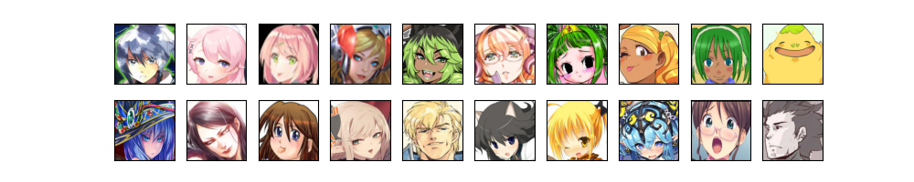
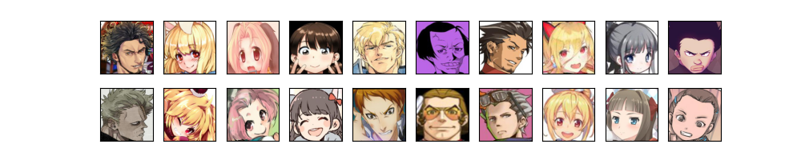

# Danbooru 2020 Zero-shot Anime Character Identification Dataset (ZACI-20)

The goal of this dataset is creating human-level character identification models which do not require retraining on novel characters. The dataset is derived from [Danbooru2020 dataset](https://www.gwern.net/Danbooru2020) [Anonymous+2021].

## Features

* Large-scale character face image dataset.
  - 1.45M face images of 39K characters (train dataset).
* Designed for zero-shot setting.
  - Characters in the test dataset do not appear in the train dataset, allowing us to test model performance on novel characters.
* Human annotated test dataset.
  - Image pairs with errorneous face detection or duplicate images are manually removed.
  - We can compare model performance to human performance.

## Benchmarks

### Random negative pairs

* Negative image pairs with different character labels are randomly sampled in this test set.
  - **Limitation:**
    - Since negative pairs are sampled in a completely random manner, most of them are *easy negative* which consists of images of clearly different characters.
    - Thus, model performance tends to be over-estimated.


<div style="text-align: center;">
Figure 1. Examples of random negative pairs (each column).
</div>

<br><br>

<div style="text-align: center;">
Table 1. Performance of benchmark models (random negative pairs).
</div>

| model name | FPR (%) | FNR (%) | EER (%) | note |
|---|---|---|---|---|
| Human | 1.59 | 13.9 | N/A | by kosuke1701 |
| ResNet-152 | **2.40** | 13.9 | 8.89 | w/ RandAug, Contrastive loss. [0206_resnet152](https://github.com/kosuke1701/AnimeCV/releases/download/0111_best_randaug/0206_resnet152.zip) by kosuke1701 |
| SE-ResNet-152 | 2.43 | 13.9 | **8.15** | w/ RandAug, Contrastive loss. [0206_seresnet152](https://github.com/kosuke1701/AnimeCV/releases/download/0111_best_randaug/0206_seresnet152.zip) by kosuke1701 |
| ResNet-18 | 5.08 | 13.9 | 9.59 | w/ RandAug, Contrastive loss. [0206_resnet18](https://github.com/kosuke1701/AnimeCV/releases/download/0111_best_randaug/0206_resnet18.zip) by kosuke1701 |

### Adversarially sampled negative pairs

* Negative image pairs which are most confusing to a trained model are kept as test set.
  - 0206_resnet152 is used as the trained model.
  - Negative image pairs are sorted by their predicted scores, and pairs with largest scores are selected.


<div style="text-align: center;">
Figure 2. Examples of adversarial negative pairs (each column). Those pairs highlight common errors by benchmark models.
</div>

<br><br>

<div style="text-align: center;">
Table 2. Performance of benchmark models (adversarial negative pairs).
</div>

| model name | FPR (%) | FNR (%) | EER (%) | note |
|---|---|---|---|---|
In progress.

### Participation

* **Your participation is welcome!!** Please create an issue if you want to add your model to this list.
* Please do not use test dataset to tune hyperparameters!!
* You can use external resources. However, please do not use any data with character labels in test dataset to ensure fair comparison.
  - Note that `/` in original character labels of Danbooru 2020 is replaced by `__`.

## Getting Started
### Download preprocessed dataset

Many thanks to [gwern](https://github.com/gwern), the dataset is now available for download via rsync. Use following commands to download and untar the dataset.

```
rsync --verbose rsync://78.46.86.149:873/biggan/20210206-kosukeakimoto-zaci2020-danbooru2020zeroshotfaces.tar ./
tar -xvf 20210206-kosukeakimoto-zaci2020-danbooru2020zeroshotfaces.tar
```

### Preprocess images

Otherwise, you can create ZACI-20 dataset from the original Danbooru 2020 dataset as follows.

* Download SFW 512 px subset of [Danbooru 2020 dataset](https://www.gwern.net/Danbooru2020).
* Install dependencies.
  - `pip install tqdm pillow`
* Crop images using a preprocessing code.
  - ```shell
    # Danbooru 2020 SFW 512 px directroy
    export DANBOORU_DIR=/path/to/danbooru2020/512px
    # train
    python process_danbooru.py --danbooru-dir ${DANBOORU_DIR} --dataset-fn dataset/zaci20_train.json --save-dir zaci20_train
    # test
    python process_danbooru.py --danbooru-dir ${DANBOORU_DIR} --dataset-fn dataset/zaci20_test.json --save-dir zaci20_test
    ```
  - Images will be stored in different directories for each character.

### Evaluate your model

* Use evaluation code.
  - `python evaluate.py --test-pairs dataset/zaci20_test_pairs.csv --test-dataset-dir zaci20_test`
  - If you want to evaluate my benchmarks, download and unzip compressed model files. [AnimeCV]() should be installed to run my benchmarks.

## Todo

- [ ] Create more difficult test dataset by adversarially sample negative image pairs.
- [ ] Evaluate and add other existing methods to the list of benchmarks.
  - [ ] https://github.com/arkel23/animesion

## Notes
### Preprocessing

* Face annotations by pre-trained EfficientDet model [Tan+2020] is used to crop images. The annotations are publicly available at [AnimeCV](https://github.com/kosuke1701/AnimeCV).
  - See https://github.com/kosuke1701/AnimeCV/releases/tag/0.0 for more details.
* All cropped face images are resized to the size of `224 x 224`. 
* `/` in original character labels of Danbooru 2020 is replaced by `__`.

### Data selection
* The methodology of [Wang,2019] is used to select images in this dataset.
  - More specifically, I only kept the images with only one character tag and only one face annotation.
* Character tags with only one image are removed.
* I split the set of characters into train/test set.
  - Characters in the test set is randomly selected from the set of characters with only two face images.
  - In this way, the number of images in the train set is maximized while keeping the diversity of characters in the test set.
* Since evaluating and annotating all negative pairs in the test set is time-consuming task, a subset of negative pairs are included in the test set.

### Benchmarks
* Benchmark models (0206_resnet, 0206_seresnet, 0206_resnet18) are trained with [this code](https://github.com/kosuke1701/optuna-metric-learning).
  - `python -u -m optuna_metric_learning.train --conf <CONFIG_FN> --model-def-fn examples/image_folder_example.py  --max-epoch 60 --patience 3 --n-fold 100`
  - Corresponding `<CONFIG_FN>`:
    - `tuned_configs/resnet18.json` (for 0206_resnet18)
    - `tuned_configs/resnet152.json` (for 0206_resnet152)
    - `tuned_configs/seresnet152.json` (for 0206_seresnet152)
  - Results of conducted hyperparameter tuning on my private dataset is listed in [this Google spreadsheet](https://docs.google.com/spreadsheets/d/1kf4XnnEpWFugO--S1zD2lOv8jWyPAyYnL66POnNZKEM/edit?usp=sharing).

### Statistics

| | size (MB) | #images | #characters |
|---|---|---|---|
| train | 16,644  | 1,451,527 | 39.038 |
| test | 26 | 2006 | 1003 |

## Citation

If you found this dataset or my benchmark models useful, please consider citing this repository and Danbooru 2020 dataset.

```
@misc{danbooru2020,
    author = {Anonymous and Danbooru community and Gwern Branwen},
    title = {Danbooru2020: A Large-Scale Crowdsourced and Tagged Anime Illustration Dataset},
    howpublished = {\url{https://www.gwern.net/Danbooru2020}},
    url = {https://www.gwern.net/Danbooru2020},
    type = {dataset},
    year = {2021},
    month = {January},
    timestamp = {2020-01-12},
    note = {Accessed: 2021-02-06} }
```

```
@misc{zaci20,
        author = {Kosuke Akimoto},
        title = {Danbooru 2020 Zero-shot Anime Character Identification Dataset (ZACI-20)},
        howpublished = {\url{https://github.com/kosuke1701/ZACI-20-dataset}},
        url = {https://github.com/kosuke1701/ZACI-20-dataset},
        type = {dataset,model},
        year = {2021},
        month = {February} }
```

## References

[Wang,2019] Yan Wang. "Danbooru2018 Anime Character Recognition Dataset," 2019, github.com/grapeot/Danbooru2018AnimeCharacterRecognitionDataset (accessed: 2021-02-11).

[Tan+2020] Tan, Mingxing, Ruoming Pang, and Quoc V. Le. "Efficientdet: Scalable and efficient object detection." Proceedings of the IEEE/CVF conference on computer vision and pattern recognition, 2020.

[Anonymous+2021] Anonymous, The Danbooru Community, and Gwern Branwen.“Danbooru2020: A Large-Scale Crowdsourced and Tagged Anime Illustration Dataset.” 2021, www.gwern.net/Danbooru2020 (accessed: 2021-02-11).